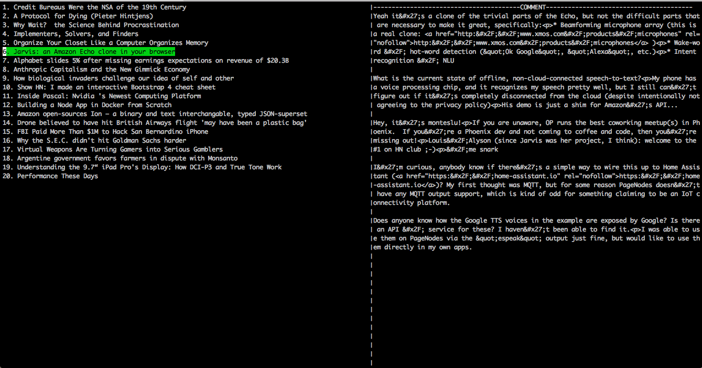

# Hacknews CUI [](https://travis-ci.org/buhe/hacknews-go)

```bash
  go install github.com/buhe/hacknews-go
```
## Fetch top N
```
NAME:
   hacknews - Fetch Top N Stories

USAGE:
   hacknews-go [fetch top N]

VERSION:
   0.0.0
```

```
 hacknews-go 20
```


## HotKey
- <kbd>CTRL</kbd>+<kbd>E</kbd> Show current story comments
- <kbd>ENTER</kbd> Open story in default brower
- <kbd>CTRL</kbd>+<kbd>C</kbd> Quit
- <kbd>← Left</kbd> or <kbd>→ Right</kbd> Comment view and story view switch
- <kbd>↑ Up</kbd> or <kbd>↓ Down</kbd> Scrol to story list
